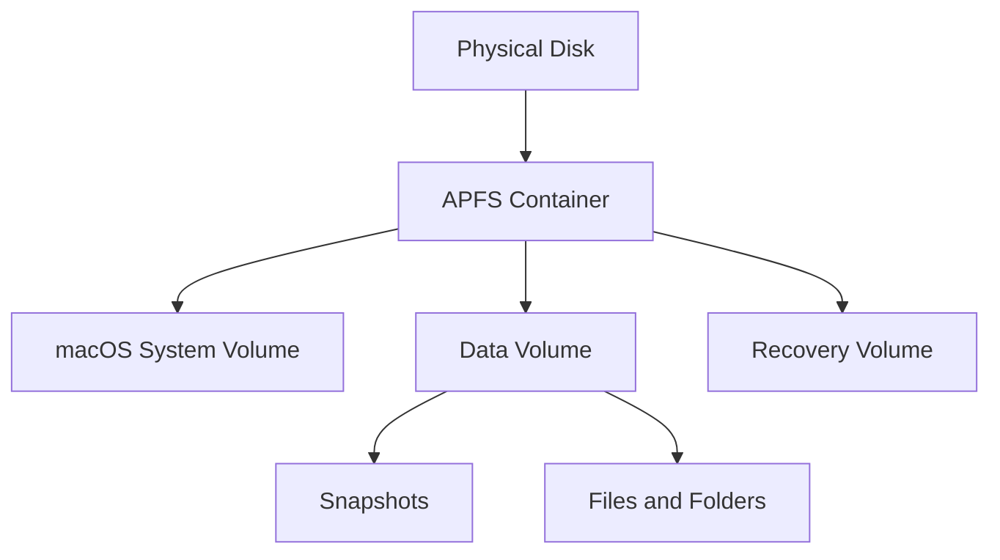

# APFS Notes

APFS stands for Apple File System. It is the modern file system used by macOS, iOS, iPadOS, watchOS, and tvOS. It replaced HFS+ and is designed for SSDs, encryption, snapshots, and fast file operations.

## Short Diagram

## Key Ideas

1. **Containers hold volumes**
   APFS uses containers that can hold multiple volumes. The volumes inside a container share the same available storage space.

2. **Space sharing is flexible**
   Volumes do not always need fixed partition sizes. One volume can use more space when another volume is using less.

3. **Snapshots capture a point in time**
   APFS snapshots can record the state of a volume at a specific moment. This is useful for backups, system updates, and recovery.

4. **Copy-on-write protects data**
   APFS writes changed data to a new location before updating references. This helps reduce corruption risk during file changes.

5. **Encryption is built in**
   APFS supports strong encryption and can protect entire volumes.

6. **Clones save space**
   APFS can duplicate files efficiently by sharing unchanged data blocks until one copy is edited.

## Why APFS Matters

APFS improves speed, reliability, and storage management on modern Apple devices. It is especially useful for SSD performance, Time Machine snapshots, encrypted storage, and systems that need multiple volumes without manually resizing partitions.
