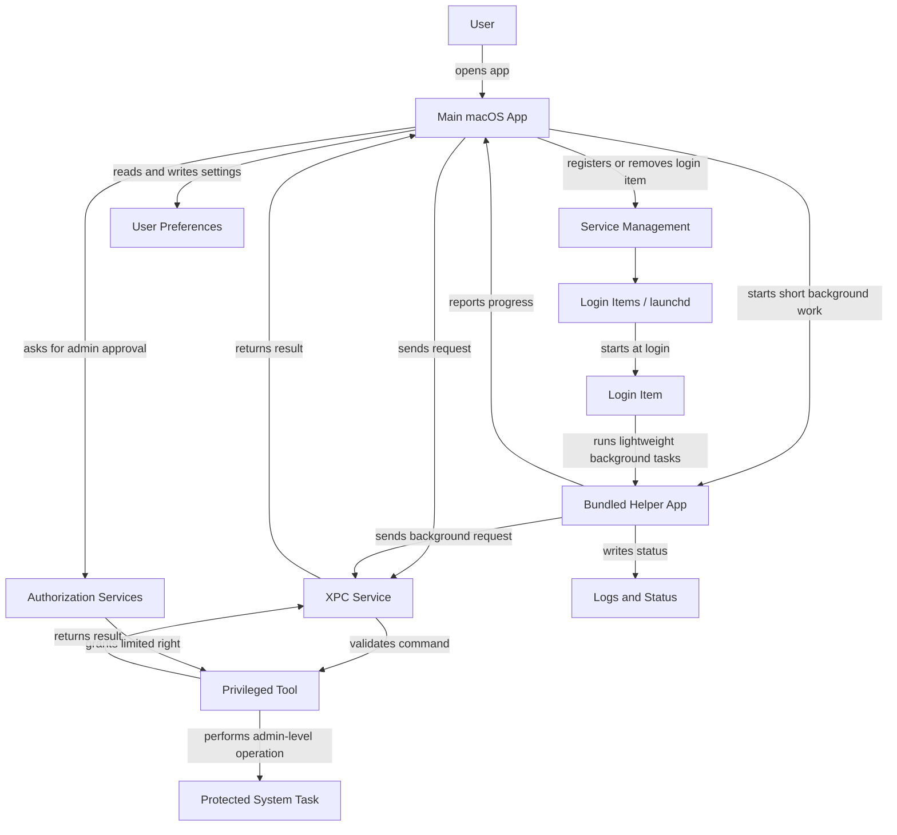

# Helpers, Login Items, and Privileged Tools Architecture

<!-- cspell:words LaunchAgent launchd XPC -->

This diagram shows the main parts of a macOS app architecture that uses helper
processes, login items, and privileged tools.

## Diagram

## Component Roles

1. **Main macOS App**
   Owns the user interface, settings, and user-triggered actions. It should
   stay unprivileged unless a specific operation needs elevation.

2. **Bundled Helper App**
   Runs background work that does not need a visible window, such as syncing,
   monitoring, or scheduled checks. It should use the smallest permission set
   possible.

3. **Login Item**
   Starts automatically when the user logs in. The main app registers or removes
   it through Service Management, and `launchd` starts it at login.

4. **XPC Service**
   Provides a narrow communication boundary between the app or helper and a
   privileged tool. It should validate requests before forwarding work.

5. **Privileged Tool**
   Performs tasks that require administrator rights, such as changing protected
   system configuration. It should expose only specific commands instead of
   general shell access.

6. **Authorization Services**
   Handles the user's administrator approval before the privileged tool performs
   elevated work.

7. **Protected System Task**
   Represents the operation that needs elevated access. Normal app and helper
   processes should not perform this directly.

## Data and Control Flow

1. The user opens the main app and changes settings.
2. The main app registers a login item when background startup is enabled.
3. At login, `launchd` starts the login item.
4. The login item or helper performs lightweight background work.
5. If elevated access is needed, the app or helper sends a limited request
   through XPC.
6. Authorization Services asks for administrator approval.
7. The privileged tool performs the approved system task and returns a result.

## Summary

The main app should manage user intent and configuration. Helpers and login
items should handle normal background work. Privileged tools should be isolated,
small, and used only for operations that truly require administrator rights.
