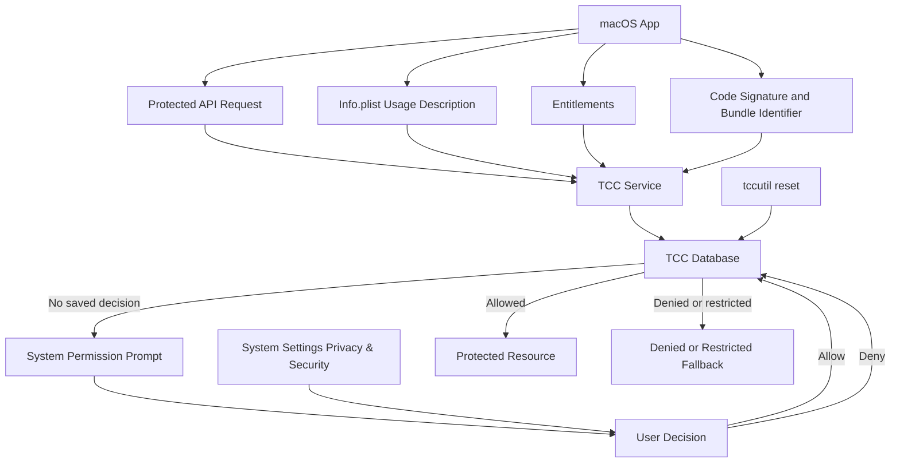

# TCC Architecture Diagram

<!-- cspell:words sandboxing tccutil -->

This diagram shows how a macOS app request moves through app identity,
entitlements, TCC, user consent, and protected system resources.

## Diagram



## Main Components

1. **macOS App**
   The app calls a protected API, such as Camera, Microphone, Accessibility, or
   Screen Recording.

2. **Info.plist Usage Description**
   Privacy usage strings explain why the app needs access. For example,
   Camera and Microphone prompts need clear usage descriptions in an app
   bundle.

3. **Entitlements**
   Entitlements declare capabilities the signed app is allowed to request.
   They do not replace user consent.

4. **Code Signature and Bundle Identifier**
   TCC uses the app's identity when storing permission decisions. Stable
   signing and a stable bundle identifier make permission testing more
   predictable.

5. **TCC Service**
   TCC checks whether the app has already been allowed, denied, or restricted
   for the requested privacy category.

6. **TCC Database**
   macOS stores the user's decisions so the same prompt does not appear every
   time the app runs.

7. **System Permission Prompt**
   If there is no saved decision, macOS can show a system prompt asking the
   user whether to allow access.

8. **System Settings**
   Users can later change many privacy decisions in System Settings > Privacy &
   Security.

9. **Protected Resource**
   If access is allowed, the app can use the requested resource, such as the
   camera, microphone, selected files, or another protected service.

10. **Denied or Restricted Fallback**
    If access is denied or restricted, the app should show a useful fallback
    instead of crashing or repeatedly asking.

## Testing Flow

During testing, use `tccutil reset` to clear saved decisions and trigger the
first-run flow again.

Example:

```bash
tccutil reset Camera com.example.MyApp
tccutil reset Microphone com.example.MyApp
```

After resetting, quit and reopen the app before retesting permission prompts.

## Summary

TCC sits between app API requests and protected resources. The app declares why
it needs access, entitlements declare what it can request, code signing
identifies the app, and TCC stores the user's final decision.
